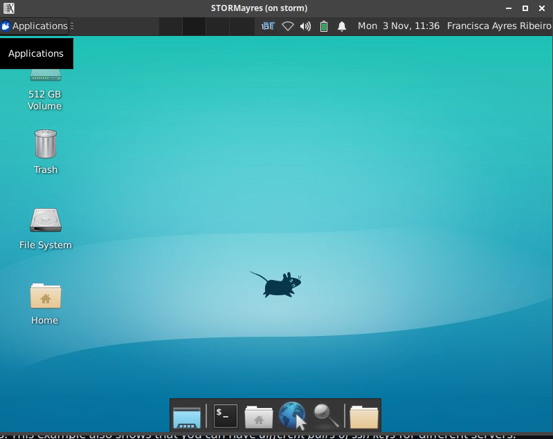
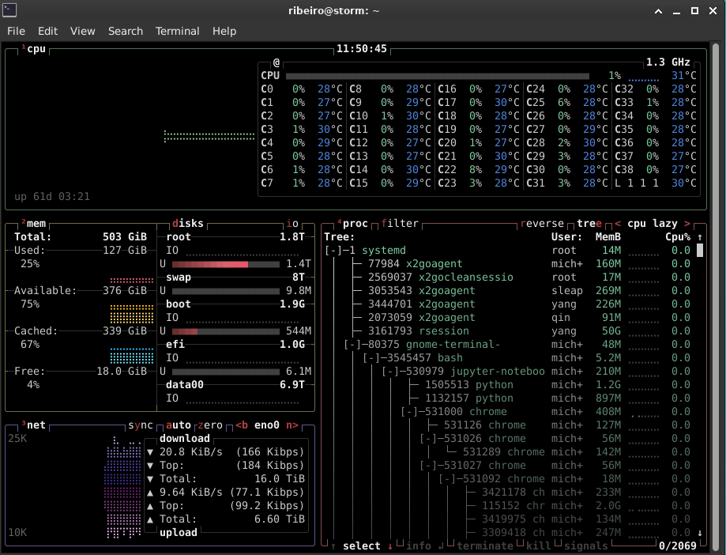
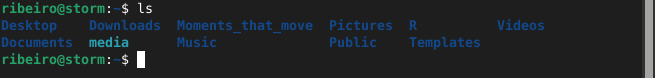
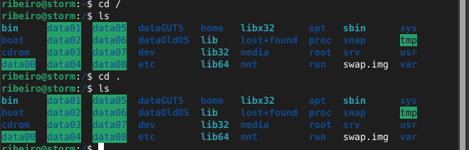
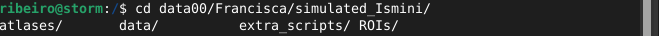
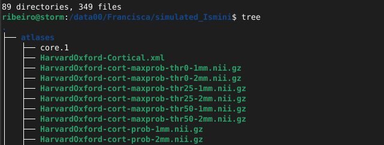
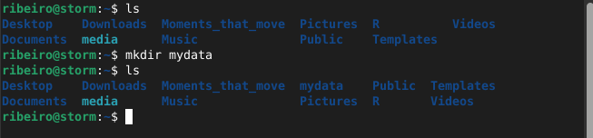
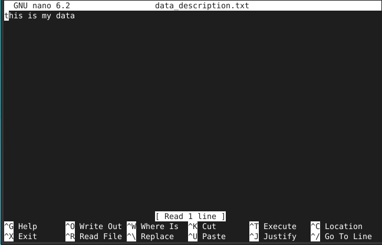
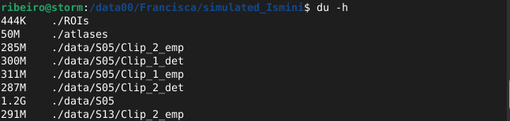
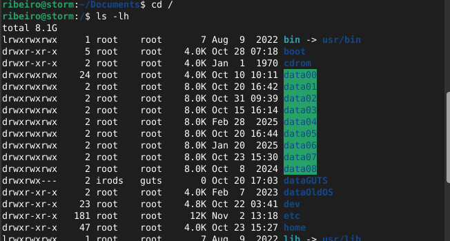

# Terminal usage 101

Francisca Ayres Ribeiro November 2025

### Table of contents
- [Enter storm from X2goClient](#enter-storm_x2goclient)
- [Open terminal] (#open-terminal)
- [Check RAM, CPU and computer cores] (#check-ram-cpu-cores)
- [Basic commands for working in terminal] (#basic-commands)
- [Work with files and folders] (#files-folders)
- [Final cheatcodes] (#cheat-codes)

## Enter storm from X2goClient (#enter-storm_x2goclient)

You should have a storm account (where the username is typically your last name) and both Twingate and X2goclient installed. Twingate allows the connection from your local computer to Storm, and X2goclient is a user interface to enter your session and credentials.

To launch twingate, you should open a terminal in your computer and type:

```bash
$ twingate start
```

This should take you to a newpage in the browser to log in with you NIN account and password. It should appear an image saying "Authenticated" and "You can close this page".

Once you have connected to twingate, you can launch X2gocleint by searching in your software files. It should appear a blue screen asking for
your session name. After, you will need to fill in your username in login and storm password. And then you should reach this:



## Open terminal

Here you can open the terminal, by clicking on the black icon with $_ . It should appear something like:


```bash
username@storm:~$ 
```

with your username.

## Check RAM, CPU and computer cores

First things first, it is good practice to check immediately how much traffic there is in storm, so you can plan your work and analysis accordingly.

For that we type in the terminal the bash command *btop*:

```bash
username@storm:~$ btop
```



Here, you start by seeing the CPU panel, that shows the number of cores (C0, C1, etc) and their use. The graph shows usage over time, with bigger spikes representing more usage.

Then, you have the memory panel that shows the memory currently used, available (that can be used or reused), cached and free (not in use). You also see the disks we have in storm and how occupied they are.

Below it you have the network panel which should the download and upload speed.

Finally, you see the process panel, with the tree formate, where you can check al the current processes, information about them and how much are they using CPU and RAM.

Reminder that CPU usage is the amount of processing power the computer is using at the given moment, including background processes and graphics, and the RAM memory usage is the computer's short-term, high-speed memory to store data that the CPU needs to access quickly while running tasks.

Pressing <kbd>F</kbd> allows your to filter the processes, by entering the user or another command. You can clear it by using the <kbd>DELETE</kbd> or <kbd>ESC</kbd> key. The <kbd>C</kbd> key will allow you to sort processes per core, and the <kbd>R</kbd>

To close btop you can use <kbd>Ctrl</kbd> + <kbd>C</kbd> (interrupt command) or press <kbd>Q</kbd> (exit).

## Basic commands for working in terminal

Now let's open a new terminal in Storm. To see where you are, you can type the following command:

```bash
username@storm:~$ pwd
```

which writes the full path name of your current directory (*p*rint *w*orking *d*irectory). IMPORTANT: the terminal is case sensitive, so make sure you are typing correctly.

To move to your home you can type:

```bash
username@storm:~$ cd
```
which stands for *c*hange *d*irectory. If you then type:

```bash
username@storm:~$ ls
```

it will list/output the folders of the directory you are in.



Here you can change directories in several levels by typing the complete path you want to go:

```bash
username@storm:~$ cd Documents/SBL_code/
username@storm:/home/Documents/SBL_code$    

```
or by returning a few steps back:

```bash
username@storm:~$ cd ..

```

where each .. is one step back

However if you type:

```bash
username@storm:~$ cd /
```
you will be moved to the root directory of storm, where you can see all the folders:



If you type cd /path/ you can press the <kbd>TAB</kbd> 2 times, to see the possible folders you can add:



Also, if you type:

```bash
username@storm:/data00/Francisca/simulated_Ismini$ tree
```

it will output the hole tree of folders and files you have in the location you are in, and the number of directories (folders) and files:




When you are in the terminal you can use the arrow up <kbd>&uarr</kbd> and down <kbd>&darr</kbd> to see older commands, in case you want to repeat them again. Alternative, you can get the full history of that terminal by typing:

```bash
username@storm:~$ history
```

If you are looking for a specific file or folder, you can type:

```bash
username@storm:~$ find name_file
```

which will output all the possible folders and file paths.


## Work with folders and files

Now, let's assume you are within your working folder and you want to create a new folder to put your data in called mydata:

```bash
username@storm:/home/$ mkdir mydata
```

If you do *ls* in the terminal you can see that it is created a new folder.



Inside this folder you can create any files you want:

```bash
username@storm:~/$ cd mydata
username@storm:~/mydata$ touch data_description.txt
```

which you can fill in how ever you want using:

```bash
username@storm:~/mydata$ echo "this is my data" > data_description.txt
username@storm:~/mydata$ cat
this is my data
```
and if you want to edit the file:
```bash
username@storm:~/mydata$ nano data_description.txt
```



Here you can edit anything you want, and make sure to <kbd>^</kbd> + <kbd>O</kbd> to save what you wrote (pressing <kbd>ENTER</kbd> and <kbd>^</kbd> + <kbd>X</kbd> afterwards to exit)

If you want to rename and/or move files:

```bash
username@storm:~/mydata$ mv data_descprition.txt new_file_name.txt
username@storm:~/mydata$ mv data_descprition.txt /path/new/location/
username@storm:~/mydata$ mv * /path/new/location
```
where \* means we are moving all the files in the folder. 
If you want to rename and/or move folders:

```bash
username@storm:~$ mv /path/to/mydata /path/new/location
username@storm:~/mydata$ mv data_descprition.txt /path/new/location/
```

Sometimes we want to copy data from one folder to another and for that we use:

```bash
username@storm:~$ cp data_description.txt /path/new/location
username@storm:~$ cp -r mydata /path/new/location
```

where *-r* means recursively, that is, that it will move all the files of the folder in question.
Similarly, we can remove files or folders:

```bash
username@storm:~$ rm data_description.txt
username@storm:~$ rm -r mydata 
```

If you want to remove multiple files with similar name and not others you can do:
```bash
username@storm:~$ rm mydata/sub-*
```
where \* fills in with all possible combintations after sub-.

To check the size of the folder and files you can use:

```bash
username@storm:/path$ du -h
```


To see the permissions and number of files you have in each folder you can do:

```bash
username@storm:/path$ ls -lh
```



## Final cheatcodes

For the main list of commands you can type:

```bash
username@storm:~$ help
```

In case you want to know more about bash commands and all the additions:

```bash
username@storm:~$ man man
```

If you want to quit something you are doing you can press <kbd>Ctrl</kbd> + <kbd>C</kbd>. 

**Attention:** Not to be confused with <kbd>Ctrl</kbd> + <kbd>Shift</kbd> + <kbd>C</kbd> which you use if you want to copy something you selected. Correspondly, <kbd>Ctrl</kbd> + <kbd>Shift</kbd> + <kbd>V</kbd> to paste in the terminal.

You can also use <kbd>Ctrl</kbd> + <kbd>A</kbd> to jump to the beginning of the line in the terminal and <kbd>Ctrl</kbd> + <kbd>E</kbd> to jump to the end


